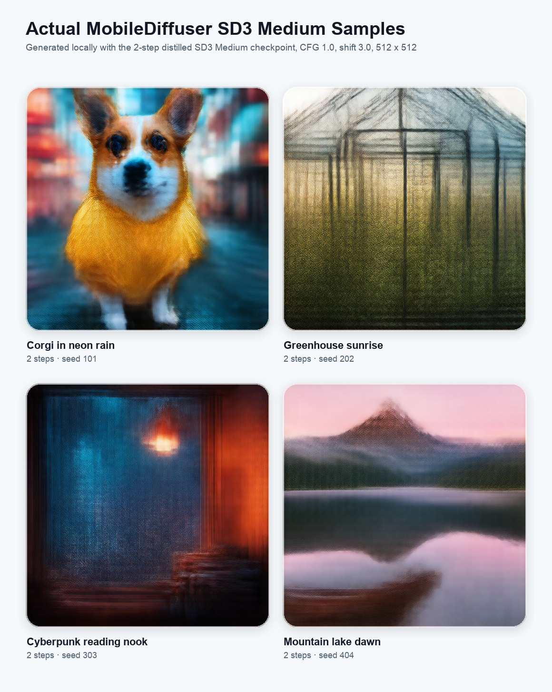
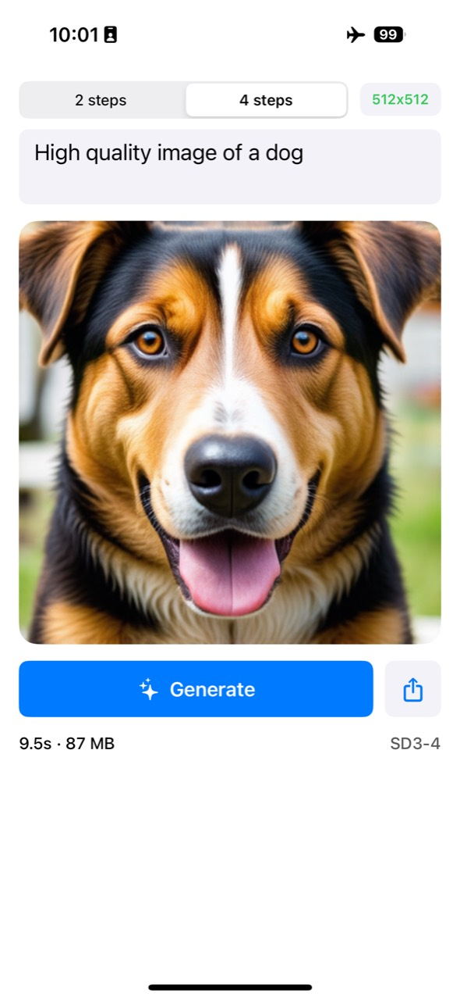
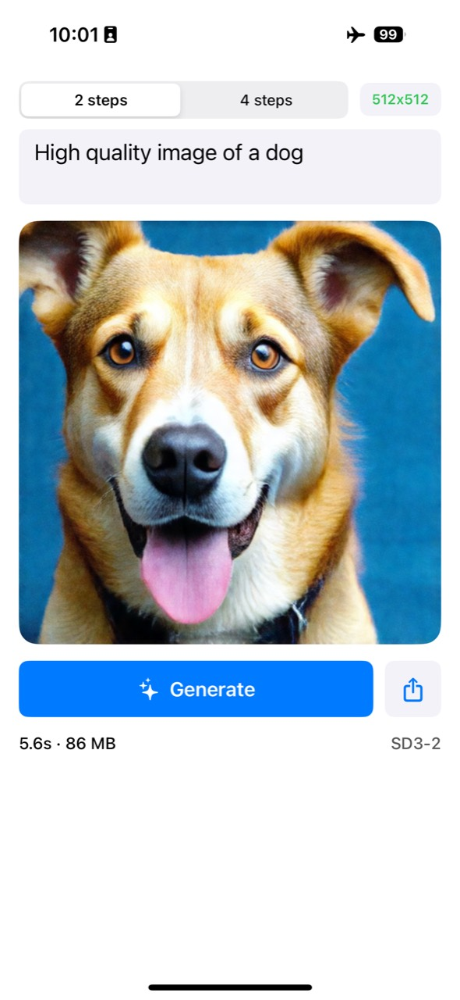

<h1>
  
  MobileDiffuser
</h1>

<br>

MobileDiffuser is an experimental iOS app for running distilled Stable
Diffusion 3 Medium locally on iPhone. The app targets 512 x 512 generation,
uses split Core ML MMDiT stages, and prefers Apple Neural Engine execution.

The repository contains the Swift app, a patched local copy of Apple's
`ml-stable-diffusion` package, conversion scripts, and documentation. It does
not contain model weights or compiled Core ML model bundles.

## Screenshots

### Generated Images

<p>
  
</p>

### UI Design

| SD3 Medium 4-step | SD3 Medium 2-step |
| --- | --- |
|  |  |

## Prebuilt Models

Prebuilt Core ML resources and the source distilled checkpoints are hosted on
Hugging Face:

[Wenwu2000/MobileDiffuser-SD3-medium](https://huggingface.co/Wenwu2000/MobileDiffuser-SD3-medium)

The app expects the compiled Core ML folders to sit directly in the project
root:

```text
MobileDiffuser/
  coremlsd3_2step/
  coremlsd3_4step/
  MobileDiffuser.xcodeproj
  MobileDiffuser/
  ml-stable-diffusion/
```

Download with Git LFS:

```bash
cd /path/to/MobileDiffuser
git lfs install
git clone https://huggingface.co/Wenwu2000/MobileDiffuser-SD3-medium /tmp/MobileDiffuser-SD3-medium
cp -R /tmp/MobileDiffuser-SD3-medium/coremlsd3_2step .
cp -R /tmp/MobileDiffuser-SD3-medium/coremlsd3_4step .
```

Or download only the folders you need with the Hugging Face CLI:

```bash
cd /path/to/MobileDiffuser
pip install -U huggingface_hub
hf download Wenwu2000/MobileDiffuser-SD3-medium \
  --include "coremlsd3_2step/**" "coremlsd3_4step/**" \
  --local-dir .
```

After downloading, confirm that these files exist:

```text
coremlsd3_2step/TextEncoder.mlmodelc
coremlsd3_2step/TextEncoder2.mlmodelc
coremlsd3_2step/VAEDecoder.mlmodelc
coremlsd3_2step/MultiModalDiffusionTransformerStage0.mlmodelc

coremlsd3_4step/TextEncoder.mlmodelc
coremlsd3_4step/TextEncoder2.mlmodelc
coremlsd3_4step/VAEDecoder.mlmodelc
coremlsd3_4step/MultiModalDiffusionTransformerStage0.mlmodelc
```

The same Hugging Face repository also contains the source checkpoints under
`checkpoints/` for users who want to reproduce or modify the Core ML conversion.

## Current Status

- Model family: Stable Diffusion 3 Medium distilled checkpoints.
- App choices: `2 steps` and `4 steps`.
- Output size: 512 x 512.
- Runtime path: CLIP-L + CLIP-G text encoders, split MMDiT, VAE decoder.
- Guidance: CFG disabled in practice, `guidanceScale = 1.0`.
- Scheduler shift: `shift = 3.0`.
- Compute units: ANE-first (`cpuAndNeuralEngine`) for app validation.
- Quantization: INT8 linear symmetric weight quantization for split MMDiT.
- Resource folders expected by the app:
  - `coremlsd3_2step/`
  - `coremlsd3_4step/`

The resource folders are intentionally ignored by Git because each one is
roughly 2.7 GB.

## Repository Layout

```text
MobileDiffuser/
  ContentView.swift              SwiftUI UI and generation view model
  DiffusionModelKind.swift        2-step/4-step model selection
  SD3PipelineLoader.swift         Core ML pipeline loading and fallback logic
  MemoryProbe.swift               Lightweight runtime memory logging
  MobileDiffuser.entitlements     Increased memory limit entitlement

ml-stable-diffusion/
  Local patched Swift package used by the app.

scripts/
  convert_sd3_medium_split_coreml.py
  quantize_mmdit_for_ane.py
  test_sd3_two_step_mac.py
  and other conversion/debug helpers.

docs/
  ARCHITECTURE.md                 Runtime design and technical details
  REPRODUCING_MODELS.md           Step-by-step model conversion guide
  IPHONE_OOM_DEBUG.md             Historical iPhone memory notes
  TECHNICAL_REPORT.md             Longer experiment report
```

## Requirements

### For running the app

- macOS with Xcode 16.2 or newer.
- iOS 18.2 or newer deployment target.
- iPhone 15 Pro or newer is recommended.
- Apple Developer account for running on a physical iPhone.
- Locally generated Core ML resources in `coremlsd3_2step/` and/or
  `coremlsd3_4step/`.

### For converting models

- Apple Silicon Mac.
- Python 3.11.
- At least 24 GB system memory recommended for conversion.
- Xcode command line tools.
- Access to the source checkpoint files.

## Quick Start

1. Clone the repository.

   ```bash
   git clone https://github.com/TWWinde/MobileDiffuser.git
   cd MobileDiffuser
   ```

2. Create the Python environment if you plan to convert models.

   ```bash
   python3.11 -m venv .venv
   source .venv/bin/activate
   pip install -U pip
   pip install -e ml-stable-diffusion
   pip install -r scripts/requirements.txt
   ```

3. Prepare model resources.

   The app expects at least one of:

   ```text
   coremlsd3_2step/
   coremlsd3_4step/
   ```

   The easiest path is to download the prebuilt resources from Hugging Face:

   ```bash
   git lfs install
   git clone https://huggingface.co/Wenwu2000/MobileDiffuser-SD3-medium /tmp/MobileDiffuser-SD3-medium
   cp -R /tmp/MobileDiffuser-SD3-medium/coremlsd3_2step .
   cp -R /tmp/MobileDiffuser-SD3-medium/coremlsd3_4step .
   ```

   Each folder must contain:

   ```text
   TextEncoder.mlmodelc
   TextEncoder2.mlmodelc
   VAEDecoder.mlmodelc
   vocab.json
   merges.txt
   MultiModalDiffusionTransformerConditioning.mlmodelc
   MultiModalDiffusionTransformerStage0.mlmodelc
   MultiModalDiffusionTransformerStage1.mlmodelc
   ...
   MultiModalDiffusionTransformerStage6.mlmodelc
   ```

   See [docs/REPRODUCING_MODELS.md](docs/REPRODUCING_MODELS.md) for the full
   conversion flow.

4. Open `MobileDiffuser.xcodeproj` in Xcode.

5. Set your signing team.

   The open-source project intentionally uses:

   ```text
   PRODUCT_BUNDLE_IDENTIFIER = com.example.MobileDiffuser
   DEVELOPMENT_TEAM = ""
   ```

   In Xcode, select the `MobileDiffuser` target, choose your Team, and change
   the bundle identifier to something unique, for example:

   ```text
   com.yourname.MobileDiffuser
   ```

6. Confirm resource folder target membership.

   If you generated `coremlsd3_2step/` or `coremlsd3_4step/`, add the folder to
   the app target as a folder reference. It must appear in the app bundle as:

   ```text
   MobileDiffuser.app/coremlsd3_2step/
   MobileDiffuser.app/coremlsd3_4step/
   ```

7. Build and run on a physical iPhone.

   The app is designed for device testing. Simulator is useful for UI only; it
   will not reproduce ANE behavior.

## Model Conversion Summary

The fastest path for reproducing the current app resources is:

```bash
# 1. Convert the distilled SD3 Medium checkpoint into split fp16 mlpackages.
.venv/bin/python scripts/convert_sd3_medium_split_coreml.py \
  --ckpt-path checkpoints/diffusion_pytorch_model.safetensors \
  --latent-h 64 \
  --latent-w 64 \
  --batch-size 1 \
  --stage-sizes 4,4,4,4,4,4 \
  --ios-target iOS18 \
  -o sd3_four_step_build_split_512

# 2. INT8 quantize and compile the split MMDiT into the app resource folder.
.venv/bin/python scripts/quantize_mmdit_for_ane.py \
  --split-dir sd3_four_step_build_split_512 \
  --split-out-dir sd3_four_step_build_split_512/int8 \
  --compile-into coremlsd3_4step \
  --ios-deployment-target 18.2 \
  --mode linear_symmetric
```

You also need text encoder, VAE decoder, and tokenizer resources. These can be
converted with the upstream Core ML Stable Diffusion tooling or copied from a
compatible SD3 Medium resource folder:

```bash
cp -R coremlsd3_2step/TextEncoder.mlmodelc coremlsd3_4step/TextEncoder.mlmodelc
cp -R coremlsd3_2step/TextEncoder2.mlmodelc coremlsd3_4step/TextEncoder2.mlmodelc
cp -R coremlsd3_2step/VAEDecoder.mlmodelc coremlsd3_4step/VAEDecoder.mlmodelc
cp coremlsd3_2step/vocab.json coremlsd3_4step/vocab.json
cp coremlsd3_2step/merges.txt coremlsd3_4step/merges.txt
```

For a complete and more careful walkthrough, use
[docs/REPRODUCING_MODELS.md](docs/REPRODUCING_MODELS.md).

## Runtime Strategy

The app uses a memory-conscious pipeline:

1. Resolve the selected resource folder (`coremlsd3_2step` or
   `coremlsd3_4step`).
2. Load CLIP-L and CLIP-G text encoders.
3. Precompute timestep conditioning.
4. Execute split MMDiT stages sequentially.
5. Decode latents through the VAE decoder.
6. Keep the pipeline alive after generation so repeated generation avoids the
   full first-load cost.
7. Cache the last generated image per model choice, so switching from 2-step to
   4-step and back restores the previous image.

The split-stage design reduces per-model ANE compiler pressure. It does not
make the total model small; it makes each compiled sub-plan small enough to
load and execute more reliably on device.

See [docs/ARCHITECTURE.md](docs/ARCHITECTURE.md) for details.

## App Controls

- `2 steps`: uses `coremlsd3_2step` and `stepCount = 2`.
- `4 steps`: uses `coremlsd3_4step` and `stepCount = 4`.
- Prompt field: text prompt sent to CLIP encoders.
- Generate: runs the selected model.
- Share: exports the current generated image.

Generation uses random seeds by default. The selected seed is printed in the
debug log:

```text
[SD3] seed: 123456789
```

Set `config.seed` explicitly in `ContentView.swift` if you need deterministic
reproduction.

## Troubleshooting

### `resources not found in app bundle`

Confirm the folder reference is included in the target membership and appears
inside the built app bundle:

```bash
find ~/Library/Developer/Xcode/DerivedData \
  -path '*MobileDiffuser.app/coremlsd3_2step' -o \
  -path '*MobileDiffuser.app/coremlsd3_4step'
```

### ANE compile or load failure

Common causes:

- The MMDiT stage is still too large.
- The model was compiled for an incompatible iOS/Core ML target.
- A stale on-device compiled ANE cache is being reused.
- The resource folder contains mixed files from different conversions.

Try:

- smaller stage sizes,
- `--ios-deployment-target 18.2`,
- deleting and reinstalling the app,
- rebooting the iPhone,
- regenerating the `.mlmodelc` folders cleanly.

### App is killed by memory pressure

Use Xcode device logs and the built-in memory log lines:

```text
[MEM] before pipeline build
[MEM] before generateImages
[MEM] step 1/4
[MEM] after generateImages
```

The app intentionally avoids eager prewarm because prewarming every Core ML
submodel can create a large initial memory spike before generation begins.

## Contributing

Contributions are welcome, especially:

- reproducible conversion notes for other SD3 distilled checkpoints,
- ANE compile/load failure reports with stage sizes and iOS version,
- memory measurements on different iPhone models,
- smaller or faster split-stage layouts,
- better UI and model management.

Please do not open pull requests that include model weights or compiled model
bundles. Share scripts, hashes, commands, and measurements instead.

## License

Code in this repository is intended to be released under the MIT License. Model
weights and converted Core ML assets are subject to their original model
licenses and are not included in this repository.
